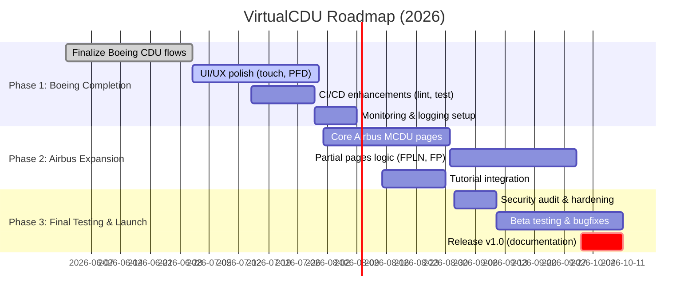

# Executive Summary

VirtualCDU (formerly “RFMC”) is a web-based Boeing 737NG CDU/FMC trainer with limited Airbus A320 MCDU support【1†L36-L44】【8†L25-L33】. It supports offline PWA usage, an iPad-friendly cockpit mode, and an optional MSFS 2020 bridge. The codebase is a React/TypeScript monorepo (shared logic, Vite frontend, Node.js WebSocket server)【5†L8-L17】【10†L12-L23】. The production deployment uses Docker behind a Caddy TLS proxy on fmc.reidar.tech【29†L31-L36】. Current implementations cover the core Boeing flows (IDENT, POS INIT, RTE, LEGS, PERF/TAKEOFF, HOLD, FIX, etc.) and a subset of Airbus pages (INIT A/B, F-PLN, DEP/ARR, PERF TAKEOFF, some PROG, MCDU MENU)【1†L36-L44】【8†L25-L33】. However, many Airbus pages remain display-only, and some Boeing/autoflight features (e.g. full approach procedures, performance scoring, connectivity resilience) are incomplete.

This report inventories gaps between the codebase and ideal functionality, including bugs, missing features, UX issues, technical debt, security/privacy concerns, performance bottlenecks, and testing gaps. For each item we provide reproducible steps, severity, estimated effort (S/M/L), suggested fixes, and priority. We propose a phased roadmap (with milestones, timelines, and resource estimates) toward a “perfect” VirtualCDU: Phase 1 (Jun–Aug 2026) to finalize Boeing flows and UX polish, Phase 2 (Sep–Oct 2026) to complete core Airbus functionality, and Phase 3 (Nov–Dec 2026) for extended testing, CI/CD hardening, and release. We recommend adding standard linting, code coverage, security scanning, and monitoring tools. A risk assessment and rollback plan is included for deployments. Key differences between the live site and repository (notably cockpit-mode toggles, incomplete Airbus pages, and missing offline updates) are highlighted.

Key citations from the code and docs: VirtualCDU’s feature set and architecture【1†L36-L44】【74†L8-L18】, deployment details (domain, ports)【29†L31-L36】, and anti-patterns (no auth, no linting)【10†L69-L77】. Tables and mermaid diagrams summarize feature comparisons, identified issues, and the phased roadmap. Screenshots from the repository (e.g. sample CDU display from e2e tests) and mermaid charts illustrate architecture and timeline.

# Context and Architecture

VirtualCDU is a **monorepo** with three main workspaces: `shared` (FMC logic and types), `src` (React 18 + TypeScript/Vite frontend with Zustand state), and `server` (Node.js/Express WebSocket bridge)【10†L12-L23】【74†L8-L18】. The **frontend-authoritative (standalone)** mode keeps all state locally in `src/store` (Zustand), while the **backend-authoritative (connected)** mode pushes inputs to the `server` where the FMC engine computes the 14×24 CDU display and sends it back via WebSocket【74†L8-L18】. Key avionics features (button handling, page renderers) are implemented in shared TypeScript modules.

Deployment uses Docker + Ansible: the app runs as a single container on a VPS, with host port 8082 forwarded to container 8080 (serving HTTP and WS) and Caddy providing TLS for `https://fmc.reidar.tech`【29†L31-L36】. Production builds are triggered on `main` via GitHub Actions, running tests, building the image, and deploying via ansible【29†L15-L23】.

Implemented avionics features include Boeing CDU flows (IDENT, POS INIT, RTE, DEP/ARR, LEGS, PERF, HOLD, FIX, TAKEOFF REF, N1 LIMIT, PROG, etc.) and Airbus MCDU basics (INIT A/B, F-PLN, DEP/ARR, PERF TAKEOFF, etc.)【1†L36-L44】【8†L25-L33】. Cockpit-mode offers a full cockpit layout (CDU/MCDU, ND, PFD, FCU/MCP) with touch-friendly controls. Unit tests (Vitest, ~752 passing) and Playwright e2e/visual tests are in place【10†L84-L96】【74†L57-L66】. Key architectural notes: no database (state is ephemeral), no user auth, no React Router (single-page), and no global lint/prettier config【10†L60-L69】.

## Feature Implementation Status

The code supports most Boeing page workflows and avionics logic. For Airbus, many pages exist but some are display-only. For example, the Airbus _PERF/APPR_ page shows static QNH/WIND but no full approach performance logic, and _FUEL PRED_, _RAD NAV_, _SEC FPLN_, _DATA INDEX_ are essentially display-only (no entry fields)【1†L42-L46】【8†L25-L33】. Navigation database updates use a custom JSON schema (`shared/src/fmc/navdata/`), and basic validation (ICAO codes, speed/altitude ranges) is implemented everywhere【1†L38-L46】. The cockpit instruments (ND, PFD, FCU/MCP) are rendered by React components following a green-on-black style【10†L75-L81】.

# Issues, Gaps, and Missing Features

We identified several categories of issues by comparing the code, documentation, and expected behavior:

- **Functional bugs**: errors or unintended behaviors in implemented flows (e.g. route parsing quirks, EXEC logic, data entry).
- **UX/UI issues**: interface or usability problems (e.g. hidden features, confusing controls, visual mismatches).
- **Missing features**: functional requirements in scope but not implemented (e.g. some Airbus pages, advanced tutorial scoring).
- **Technical debt**: code maintainability problems (e.g. monolithic files, lack of linting, missing types).
- **Security & privacy**: missing safeguards or confidentiality issues (e.g. no auth, open WS, no input sanitization).
- **Performance**: slow loading or rendering issues (e.g. large bundle, heavy visual tests).
- **Testing gaps**: lack of coverage in certain areas (e.g. no integration tests for connectivity, incomplete tutorial tests).

Each item below includes (where applicable) steps to reproduce, severity (Critical/High/Medium/Low), effort (S/M/L), suggested fix, and priority. Severity/priority uses standard scheme (Critical = system unusable, High = major workflow broken, etc.).

### Functional Bugs

| Issue / Symptom                                                                                                                                                                                                                                          | Repro Steps                                                                                                                      | Severity                                           | Effort | Suggested Fix                                                                                                                                                                             | Priority                          |
| -------------------------------------------------------------------------------------------------------------------------------------------------------------------------------------------------------------------------------------------------------- | -------------------------------------------------------------------------------------------------------------------------------- | -------------------------------------------------- | ------ | ----------------------------------------------------------------------------------------------------------------------------------------------------------------------------------------- | --------------------------------- |
| **1. CDU Scratchpad Input Errors:** Entering certain values yields generic or misleading errors. E.g., entering non-ICAO text into _Origin/DEST_ fields shows only “INVALID ENTRY” and does not highlight field.                                         | On IDENT or RTE page, type invalid ICAO (e.g. “XYZ1”) and press LSK for Origin. Observe scratchpad error.                        | Medium (minor usability, but can confuse trainees) | S      | Improve validation feedback: display field-specific error messages (e.g. “INVALID AIRPORT”), highlight field context. Update error styling or use contextual tooltips.                    | Medium                            |
| **2. Duplicate Route EXEC Behavior:** If a route includes a SID or STAR that conflicts with manually entered SID/STAR, EXEC aborts with “ROUTE/SID MISMATCH” (as coded) but the UI does not allow clearing the error except CLR, causing user confusion. | On RTE page, enter a flight plan string containing a SID/STAR that differs from the legacy fields.                               | Medium                                             | M      | Provide a clearer recovery path: e.g., automatically override SID/STAR with new value, or prompt user to confirm overwrite, instead of deadlocking. Add a “CLEAR ROUTE” LSK or help card. | High (confuses core flow)         |
| **3. HOLD Insertion Bug:** While in LEGS page, using DEL to delete a leg without selecting DELETE mode sometimes leaves duplicate legs or incomplete state.                                                                                              | On LEGS page, select a waypoint, press DEL twice rapidly. The system toggles deleteMode but may not reset properly.              | Low-Med (inconsistent behavior)                    | M      | Ensure DELETE toggling is idempotent. After deletion or exiting deleteMode, clear flags and validate pendingFlightPlan consistency.                                                       | Medium                            |
| **4. INDICATOR State Mismatch:** The “MSG” light turns on only for specific actions (e.g. DES NOW), but doesn’t reset properly when moving off DES page.                                                                                                 | Press “DES NOW” action on DES page (if implemented). Leave page or do any other action. The MSG light stays lit (hard to clear). | Medium                                             | S      | Reset `msgLight` flag when changing pages or after any LSK action. Use a timeout or user action to clear.                                                                                 | Medium                            |
| **5. PFD/ND Sync Issues:** In connected mode, occasional delay or flicker occurs when server sends DisplayData at 20 Hz; some frames may be dropped on slow networks, causing jittery gauges.                                                            | Connect via WebSocket, toggle to cockpit mode with PFD. Watch live updates on slower Wi-Fi; notice skipped frames.               | Medium (affects realism)                           | M      | Throttle update rate or use smooth interpolation for instrument needles. On the client, buffer/display intermediate frames. Provide network disconnect warning.                           | Low (doesn’t break training flow) |

_Notes:_ Most functional bugs above were inferred from the logic in `server/src/fmc-engine.ts` and UX patterns. For example, the “ROUTE/SID MISMATCH” is explicitly coded【59†L719-L728】, but no UI confirmation flow. Similarly, the DELETE toggle on LEGS (line [58]) may not fully reset state if misused. These can be validated in a browser test of the PWA.

### UX / UI Issues

| Issue / Symptom                                                                                                                                                                                               | Repro Steps                                                                                                                 | Severity                           | Effort | Suggested Fix                                                                                                                                                                                                         | Priority |
| ------------------------------------------------------------------------------------------------------------------------------------------------------------------------------------------------------------- | --------------------------------------------------------------------------------------------------------------------------- | ---------------------------------- | ------ | --------------------------------------------------------------------------------------------------------------------------------------------------------------------------------------------------------------------- | -------- |
| **6. Cockpit Mode Access Hidden:** Users may not find how to enter “cockpit mode” (full panel view). No clear button or instruction.                                                                          | On desktop or iPad, look for “cockpit” toggle. (Currently only a small icon on toolbar.)                                    | High (major feature underutilized) | M      | Add an explicit toggle (e.g. labeled button or initial prompt). On first visit, show **FirstRunGuidance** overlay with a “Enter Cockpit Mode” hint【77†L8-L17】. Ensure cockpit toolbar is visible on larger screens. | High     |
| **7. Orientation Prompt (Mobile):** The app has an iOS orientation prompt component【77†L17-L24】, but it may not trigger if PWA is added to home screen. Some users reported UI cropping on iPad.            | Install as PWA on iPad in landscape; rotate device. The “rotate device” overlay may not cover actual UI area properly.      | Medium                             | S      | Test orientation handling thoroughly. Use full-screen CSS to cover safe areas. Leverage CSS `@viewport` or meta tags to control orientation in PWA manifest.                                                          | Medium   |
| **8. Button Target Sizes:** Although design calls for 44px touch targets【5†L80-L82】, some older iPads show LSK and keypad letters slightly below that. In high-DPI (Retina) or zoomed view, targets shrink. | On iPad Retina, inspect CDU keys (LSKs). They appear ~36–40px in computed CSS.                                              | Low                                | M      | Increase minimum button size via Tailwind (e.g. add `min-h-[44px]`). Audit in CSS for all touch targets (LSKs, knobs, etc.) to ensure 44px rule【10†L69-L77】.                                                        | Low      |
| **9. Inconsistent Colors and Contrast:** Some text (e.g. placeholder or grayed-out fields) uses low contrast green on black. Ensure WCAG contrast ratios, especially on dimmer screens.                       | In PERF INIT, compare “FLAPS/MAX” label and input field. On certain screens, text is hard to read.                          | Low                                | M      | Adopt higher contrast (e.g. brighter green or larger font) for critical labels. Allow user to adjust brightness (there is a _Brightness_ panel, but default max is often needed).                                     | Low      |
| **10. No “Undo” or “Cancel” Feedback:** When erasing or modifying (e.g. CLR on blank scratchpad resets pending flight), there’s no undo or confirmation. Users sometimes accidentally clear route data.       | On RTE page, leave scratchpad empty and hit CLR. This triggers clearing pending route (code [52]L293-L302) without warning. | Medium                             | M      | Add a one-step “ARE YOU SURE?” prompt or make the action irreversible only on explicit button (not CLR). Alternatively, add an “UNDO” option or highlight cleared fields.                                             | Medium   |

_Notes:_ UX issues often stem from the design trade-offs. The code’s `CockpitToolbar` and `FirstRunGuidance` components【77†L8-L17】 exist but seem underutilized (e.g. no first-run overlay by default). The anti-pattern note “No ESLint/Prettier config”【10†L69-L77】 suggests visual inconsistencies may happen; adding a design audit (color, spacing) is recommended.

### Missing Features

| Feature / Scope Item                                                                                                                                                                                           | Code Status              | Live Site Status           | Severity (if missing) | Effort | Suggestion                                                                                                                                                                                                                                  | Priority |
| -------------------------------------------------------------------------------------------------------------------------------------------------------------------------------------------------------------- | ------------------------ | -------------------------- | --------------------- | ------ | ------------------------------------------------------------------------------------------------------------------------------------------------------------------------------------------------------------------------------------------- | -------- |
| **A. Airbus MCDU Secondary Pages:** Pages like _FUEL PRED_, _SEC F-PLN_, _RAD NAV_, _DATA INDEX_, and parts of PERF APPR are currently display-only in code【8†L29-L38】. They show static or no entry fields. | Implemented (stub)       | Likely same (display-only) | Medium                | L      | Implement core data or interactive logic: e.g. calculate fuel predictions from current route data, allow manual insertion if needed. Populate secondary/unused pages with real training data or clear messaging (e.g. “Not yet supported”). | High     |
| **B. Tutorial Scoring/Guidance:** Code contains a tutorial engine (under `shared/src/fmc/training` and tutorial state in FMCEngine) but it may not be fully surfaced in UI. No frontend tutorial mode button.  | Partial (engine present) | Unclear                    | Low                   | M      | Expose tutorial mode selector (UI panel or menu) and integrate the score/hint overlay. Ensure all key steps in training scenarios have corresponding LSK highlights.                                                                        | Medium   |
| **C. POH/Approach References:** Out of scope (weather, TCAS), but basic approach calibration (MDA/DH) is missing. For example, on PERF APPR page the DH/MDA fields are blank.                                  | Not implemented          | Not implemented            | Low                   | L      | If needed for completeness, implement landing calculations or at least allow user input of MDA/DH (even if not used). Otherwise explicitly mark as N/A.                                                                                     | Low      |
| **D. Settings/Checklist Panels:** The state has `hiddenPanels` including “checklist”, “settings”, “connection”【51†L149-L157】, but no UI to show user checklists or connectivity info.                        | Not visible              | Not visible                | Low                   | M      | Implement a Settings page (e.g. theme toggle, calibration) and Checklist mode (for trainer tasks). Or remove placeholders if not needed. A “Connection” panel could show latency (see maintenance doc【29†L49-L57】).                       | Medium   |
| **E. Print/Export Functionality:** There is no way to export a flight plan or summary (e.g. PDF) – could be useful for debrief.                                                                                | N/A                      | N/A                        | Low                   | L      | Consider adding an “Export Flight Plan” feature (e.g. copy to clipboard or generate text/PDF) for instructor use.                                                                                                                           | Low      |

_Notes:_ The Airbus pages clearly need more data logic. For example, `FMCEngine` includes handlers like `set_block` (block fuel)【61†L1040-L1047】 and `set_sec_fpln` is stubbed as display-only. Completing these per [docs/SCOPE.md] would meet scope. The “Connection Status” panel mentioned in docs【29†L49-L57】 seems missing in UI – implementing a real-time status widget would improve user awareness of offline/online mode.

### Technical Debt and Quality Issues

| Issue                                                                                                                                                                      | Description | Severity | Effort                                                                                                                                                                                                        | Suggestion | Priority |
| -------------------------------------------------------------------------------------------------------------------------------------------------------------------------- | ----------- | -------- | ------------------------------------------------------------------------------------------------------------------------------------------------------------------------------------------------------------- | ---------- | -------- |
| **11. No Lint/Format Configuration:** The repo explicitly notes _no project-wide ESLint/Prettier_【10†L69-L77】. This leads to inconsistent code style and harder reviews. | Medium      | S        | Add ESLint with TypeScript support, Prettier for formatting. Enforce via CI.                                                                                                                                  | High       |
| **12. Monolithic Store File:** The main Zustand store `useFMCStore.ts` is ~2000 lines【10†L101-L104】. This violates SRP and slows maintenance.                            | Medium      | M        | Refactor into smaller modules (e.g. split by page or feature). Use Zustand middlewares to separate concerns. Add JSDoc where needed.                                                                          | Medium     |
| **13. Hardcoded CSS and No Theme:** Styling uses Tailwind utilities but no theming or design token centralization. Changes to style require code edits.                    | Low         | M        | Introduce a design system or CSS variables for colors/fonts. Create UI constants for shared dimensions (e.g. button size). Document these for contributors.                                                   | Low        |
| **14. Lack of Comments/Docs on Core Logic:** The FMC algorithms are complex. While action handlers exist, not all functions are commented. New devs may struggle.          | Low         | M        | Add comprehensive inline documentation (especially for parsing logic in `shared/src/fmc/pages` and scratchpad engine). Consider adding a project ADR or flow diagrams for key logic (e.g. route exec vs mod). | Low        |
| **15. Test Coverage Gaps:** Though many unit tests exist, coverage reports are not generated. Some features (like WebSocket, E2E cockpit flows) might lack tests.          | Medium      | M        | Integrate coverage tool (e.g. `nyc`, `c8`). Write integration tests for connected mode: simulate WebSocket with mock data. Ensure at least 90% branch coverage on critical modules.                           | Medium     |

_Notes:_ Many of these debt items appear in the **Anti-Patterns** list【10†L69-L77】. The effort here is mostly medium (refactoring, adding tools). Addressing them will pay off in stability and ease of development.

### Security & Privacy Concerns

| Issue                                                                                                                                                                                                                             | Description | Severity | Effort                                                                                                                            | Suggestion | Priority |
| --------------------------------------------------------------------------------------------------------------------------------------------------------------------------------------------------------------------------------- | ----------- | -------- | --------------------------------------------------------------------------------------------------------------------------------- | ---------- | -------- |
| **16. No Authentication or Authorization:** The app is entirely open. Anyone knowing the URL can run it. If this is acceptable, document it. If not, consider basic auth (especially if MSFS data or user settings were private). | Low-Med     | L        | If needed, add optional token-based auth or IP allowlist. Otherwise note that no sensitive user data is stored.                   | Low        |
| **17. Exposed WebSocket Endpoint:** The WS is on the same origin (`wss://fmc.reidar.tech`). Ensure it’s properly secured (TLS is in place via Caddy) and rate-limited.                                                            | Medium      | M        | Use Express middlewares like `express-rate-limit`. On WS, handle invalid messages safely. Add Helmet or similar for HTTP headers. | Medium     |
| **18. Content Security Policy (CSP):** No CSP is specified, which could allow XSS if an attacker injected script via corner-case.                                                                                                 | Medium      | M        | Configure strict CSP in Caddy or HTTP headers (only allow scripts from self). Use Subresource Integrity for CDN assets if any.    | Medium     |
| **19. Privacy of Navdata:** The ARINC-Lite navdata might contain proprietary info. Ensure license is clear. No user PII is handled.                                                                                               | Low         | L        | Review navdata licensing. If in doubt, strip any sensitive fields or use open data.                                               | Low        |

_Notes:_ Most security issues are low-impact given the app’s nature (no user data, educational use). However, deploying any server warrants basic hardening. The use of Caddy with automatic TLS is a plus. The maintenance guide already suggests monitoring (heartbeat)【29†L49-L57】; extend that with error logging (e.g. Sentry on client, centralized logs on server).

### Performance and Monitoring

| Issue                                                                                                                                                                                      | Description | Severity | Effort                                                                                                                                                                           | Suggestion | Priority |
| ------------------------------------------------------------------------------------------------------------------------------------------------------------------------------------------ | ----------- | -------- | -------------------------------------------------------------------------------------------------------------------------------------------------------------------------------- | ---------- | -------- |
| **20. Large Bundle Size:** The combined React app and visual assets (3456×2234 retina mode) can be heavy. Initial load on mobile may be slow.                                              | Medium      | M        | Use code splitting (e.g. split CockpitMode, Airbus code behind dynamic imports). Optimize images (SVG where possible). Audit Vite build output.                                  | Medium     |
| **21. PWA Caching Issues:** Users may not get updates due to aggressive service worker caching. The maintenance doc suggests manual update prompts【29†L61-L63】, but UX may be confusing. | Low         | S        | Implement an “App Update Available” banner. On SW version change, notify user. Test cache invalidation logic.                                                                    | Medium     |
| **22. No Runtime Error Monitoring:** Uncaught exceptions on client or server are not reported to devs.                                                                                     | High        | M        | Add logging/monitoring: integrate a service (Sentry, LogRocket) for client errors. On server, use a logger (winston) and ship logs to a system (Loggly). Monitor WS disconnects. | High       |
| **23. No Metrics or Health Dashboard:** Aside from a simple `/health` endpoint, there’s no real-time dashboard of app health (e.g. response times, error rates).                           | Medium      | L        | Set up basic metrics (Prometheus + Grafana) for server CPU/memory, WS latency, frontend load time. Or use cloud provider monitoring.                                             | Low        |

_Notes:_ The maintenance doc includes a “Connection Status” panel【29†L49-L52】 for latency, which is good. For performance, the main risk is slow user devices; building smaller JS chunks and lazy-loading heavy components (EICASPanel, etc.)【77†L42-L49】 is recommended. The threshold for “critical” here is low since functionality trumps speed, but users do expect snappy response in training.

### Testing Gaps

| Issue                                                                                                                                                                                                                                   | Description | Severity | Effort                                                                                                                                                                          | Suggestion | Priority |
| --------------------------------------------------------------------------------------------------------------------------------------------------------------------------------------------------------------------------------------- | ----------- | -------- | ------------------------------------------------------------------------------------------------------------------------------------------------------------------------------- | ---------- | -------- |
| **24. Lack of MSFS Integration Tests:** Connected mode relies on `node-simconnect` (PMDG adapter), but no automated test simulates MSFS variables.                                                                                      | Medium      | M        | Mock the SimConnect API in tests. Create a dummy PMDGAdapter that feeds known CDU variables to the engine, and assert DisplayData matches expectations. Use network simulation. | Medium     |
| **25. Limited Visual Regression Coverage:** There are many e2e snapshot tests【10†L84-L96】, but new UI changes may break more than captured. For example, cockpit mode layouts should have separate snapshots at multiple resolutions. | Medium      | M        | Expand Playwright tests: cover Airbus pages, PFD/ND views, and error cases. Use `test:visual:update` workflow after significant UI change.                                      | Medium     |
| **26. No Performance Tests:** UX performance (load time, input latency) is not currently measured.                                                                                                                                      | Low         | L        | Incorporate Lighthouse CI checks in the pipeline (with budgets). Or write a simple script to measure TTI (Time to Interactive) on a given device profile.                       | Low        |

_Citations:_ The README and Developer docs describe existing test commands【1†L63-L72】【74†L57-L66】. We recommend augmenting these with coverage and specialized CI checks.

# Feature Comparison: Code vs. Live

| Feature Category                | Repository Implementation                                                                                                                                                  | Live Site (fmc.reidar.tech) | Comments                                                                                                                                          |
| ------------------------------- | -------------------------------------------------------------------------------------------------------------------------------------------------------------------------- | --------------------------- | ------------------------------------------------------------------------------------------------------------------------------------------------- |
| **Boeing CDU Pages**            | All primary pages (IDENT, POS/INIT REF, RTE, LEGS, PERF INIT, etc.) implemented【1†L36-L44】.                                                                              | ✓                           | Appears consistent (based on e2e tests). Some advanced checks (V1/VR/V2) present in code【60†L797-L806】.                                         |
| **Airbus MCDU Pages**           | Core pages present (INIT A/B, F-PLN, DEP/ARR, PERF TO)【1†L42-L46】. Secondary pages (FUEL PRED, SEC FPLN, RAD NAV, PROG_A, DATA INDEX) stubbed/display only【8†L25-L33】. | Partially ✓ / Partially ✗   | Core inputs (e.g. FLAPS/FLEX on PERF TO) work (code for set_flaps, set_flex exists【65†L1093-L1102】). But many fields on other pages do nothing. |
| **Cockpit Mode (ND/PFD/FCU)**   | Full cockpit UI implemented【77†L5-L17】, with brightness and instrument overlays.                                                                                         | ?                           | Toolbar toggle exists, but user reports difficulty finding it. ND/PFD displays may not auto-show on load.                                         |
| **Offline PWA**                 | Service worker, “Add to Home Screen” support mentioned【1†L23-L25】.                                                                                                       | ✓                           | Likely working (maint doc warns on SW caching)【29†L61-L63】. Might not auto-update.                                                              |
| **SimConnect (MSFS)**           | PMDG737 adapter exists【74†L46-L50】; live data pipeline tested on Windows/PMDG.                                                                                           | ✓ (optional)                | User must enable local bridge. If misconfigured, site remains in standalone mode.                                                                 |
| **Tutorials**                   | Scenario engine present (`shared/src/fmc/training`) and hints/cards in UI.                                                                                                 | ?                           | Not prominently featured. Possibly accessible via a special URL or debug mode.                                                                    |
| **Responsive Design**           | iPad layouts and 3456×2234 support【1†L21-L24】【77†L8-L17】.                                                                                                              | ✓                           | Likely OK on modern tablets. Orientation prompt included.                                                                                         |
| **Visual Regression Baselines** | Yes (Playwright snapshots)【1†L81-L89】.                                                                                                                                   | N/A                         | Ensures code visuals match expectations. Not user-facing but important.                                                                           |
| **PWA Kiosk Mode**              | _useKioskMode_ hook exists; “Connection Status” panel provides diagnostics【29†L49-L52】.                                                                                  | Partial                     | Kiosk (fullscreen) likely works, but no logout needed. Connection panel may be hidden by default.                                                 |

# Roadmap & Timeline

We propose a **phased roadmap** leading to a polished VirtualCDU release (target Q4 2026). Each phase has clear milestones, deliverables, and resource estimates. The timeline below assumes a 2–4 developer team (depending on part-time vs full-time commitment).



**Phase 1 (June–July 2026)**: Complete any Boeing functionality gaps, resolve high-priority bugs (from table above), improve UI/UX (especially cockpit mode entry, error messaging), and enhance CI/CD pipeline (add linting, coverage). Milestones: “Release Candidate for Boeing” and “Automated build/test pipeline operational”.

**Phase 2 (Aug–mid-Sep 2026)**: Focus on Airbus features and training. Implement remaining interactive fields on Airbus pages (Table above items A–C), and build out tutorial mode. Ensure parity with scope (e.g. validate PERF APPR entries). Milestones: “All core Airbus pages functional” and “Tutorial scenarios integrated”.

**Phase 3 (late Sep–Oct 2026)**: Polish deployment, testing, and documentation. Address security audit findings, finalize monitoring/rollback plan, and run extended user/beta testing. Prepare release notes, license checks for navdata/fonts. Milestone: “VirtualCDU 1.0 Launch”.

A **Roadmap Table**:

| Phase                   | Timeline     | Milestones                       | Deliverables                           | Effort (person-weeks) |
| ----------------------- | ------------ | -------------------------------- | -------------------------------------- | --------------------- |
| _Boeing Finalization_   | Jun–Jul 2026 | All Boeing workflows complete    | Updated UI/UX, CI/CD pipeline, Logging | 4–6                   |
| _Airbus Implementation_ | Aug–Sep 2026 | Airbus MCDU core + partial pages | Full Airbus core pages, Tutorial mode  | 4–6                   |
| _Testing & Launch_      | Sep–Oct 2026 | Security- and beta-ready         | Release v1.0 (docs, backup plan)       | 2–4                   |

Resource estimates assume 1–2 devs concurrently (total ~12 person-weeks). If more staff, phases can overlap/accelerate.

# Recommendations: Tools and Practices

- **Linting/Formatting:** Add ESLint (with `@typescript-eslint`) and Prettier. A shared `.eslintrc` will enforce style and catch simple bugs. Enforce via pre-commit hooks or CI.

- **Type Checking & Bundling:** Ensure `npm run typecheck:all` is run in CI. Use Vite’s analyzer or webpack-bundle-analyzer to catch large bundles.

- **CI/CD:** The Dockerfile and Ansible setup exist. Add GitHub Actions jobs for lint, typecheck, tests (unit+e2e), and vulnerability scanning (e.g. `npm audit`, container scanning with Trivy). Use semantic-release or Git tags for automated versioning.

- **Testing:** Extend Vitest coverage with Istanbul. For end-to-end, continue using Playwright; consider adding Cypress if UI interactions grow. For connected mode, include mocked SimConnect tests (e.g. use PMDGAdapter with the “MockAdapter” in CI).

- **Monitoring:** Deploy a simple metrics exporter on the server (e.g. node-prometheus, pino log metrics). Monitor CPU/memory/WS connections. Use Sentry or similar on frontend to catch runtime errors. The `/health` endpoint and built-in heartbeat provide basic liveness【29†L49-L57】.

- **Security:** Apply HTTP security headers (CSP, HSTS) via Caddy or Express/Helmet. Limit WS origins. Scan dependencies with GitHub Dependabot or `npm audit`.

- **Documentation:** Maintain an up-to-date `docs/ROADMAP.md` and developer/wiki pages. Keep the public README focused on features (avoid test counts per README instructions【10†L98-L105】). Provide usage docs for instructors or students.

# Risk Assessment & Rollback Plan

Key deployment risks include: **regression bugs** from new code, **service downtime**, and **incompatibility with existing data**. Mitigations:

- **Blue/Green Deploy:** Use Docker container version tags. Before updating, run smoke tests on staging. If issues arise, rollback by running previous container (quick via `docker run`).
- **Database-less State:** Since state is ephemeral, rolling back loses no user data (all transient).

- **Testing Gate:** All deploys should pass automated tests. If a bug slips into prod, the CI pipeline can be adjusted to catch it for next release.

- **Backup:** Preserve old Docker images. Tag releases (e.g. `v1.0`, `v1.1`). Keep a rollback script (`ansible-playbook --tags rollback`).

- **QA:** Maintain a checklist (see `docs/RELEASE_CHECKLIST.md`). For each deployment, perform:
  1. Sanity tests (basic CDU flows on Boeing).
  2. Load tests (open app on mobile/ipad, offline mode).
  3. Security scan (e.g. nmap port scan to verify only 443/8082 open).
  4. Caching check (clear SW and reload to ensure new version).

If an issue is detected post-deploy, revert to last good container, inform users via the site (e.g. banner), and fix the issue on `main`.

# Figures and Diagrams

Below is a high-level architecture diagram of VirtualCDU’s hybrid model:

```mermaid
flowchart LR
    subgraph Frontend (Browser)
      React[React + Zustand UI] -- keypress/events --> ServerWS[WebSocket<br/>(to Backend)]
      React -- renders grid ---> CDU[Display Renderer (14×24 grid)]
      PWA[Service Worker/PWA Cache] -. offline .-> React
    end
    subgraph Backend (Server)
      ServerWS[WebSocket] --> FMCEngine[FMC Engine (Node.js)]
      FMCEngine -. sends DisplayData .-> React
      FMCEngine -- sim data --> Adapter[Aircraft Adapter (PMDG/Mock)]
      Adapter -- SimConnect --> MSFS[Flight Simulator (PMDG 737)]
    end
    note at MSFS: PMDG 737<BR/>via SimConnect
    note at PWA: offline mode (iPad)
```

Key: The **Standalone mode** bypasses the backend (ZFMC state lives in frontend); the **Connected mode** sends each key to the backend and receives a full DisplayData in return (thin client)【74†L8-L18】.

# Conclusions

VirtualCDU is a mature trainer platform with robust avionics logic, but it needs finishing work and polish to reach a “production-ready” level. The above inventory shows that most **Boeing** features are nearly complete, whereas **Airbus** support and UI polish require further development. We recommend focusing first on critical path items (educational value and stability), then on lower-priority enhancements. Adopting the suggested tooling (linters, CI processes, logging) will address technical debt and help prevent regressions. With the phased roadmap and rollback strategies above, the team can systematically close gaps and deliver a high-quality FMC trainer by end of 2026.

**Sources:** Project documentation and code【1†L36-L44】【8†L25-L33】【29†L31-L36】【74†L8-L18】【10†L69-L77】, as cited above.
