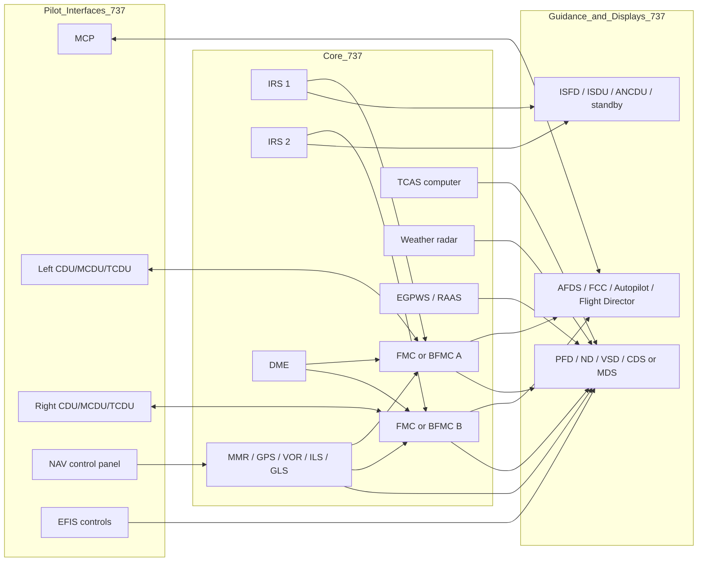
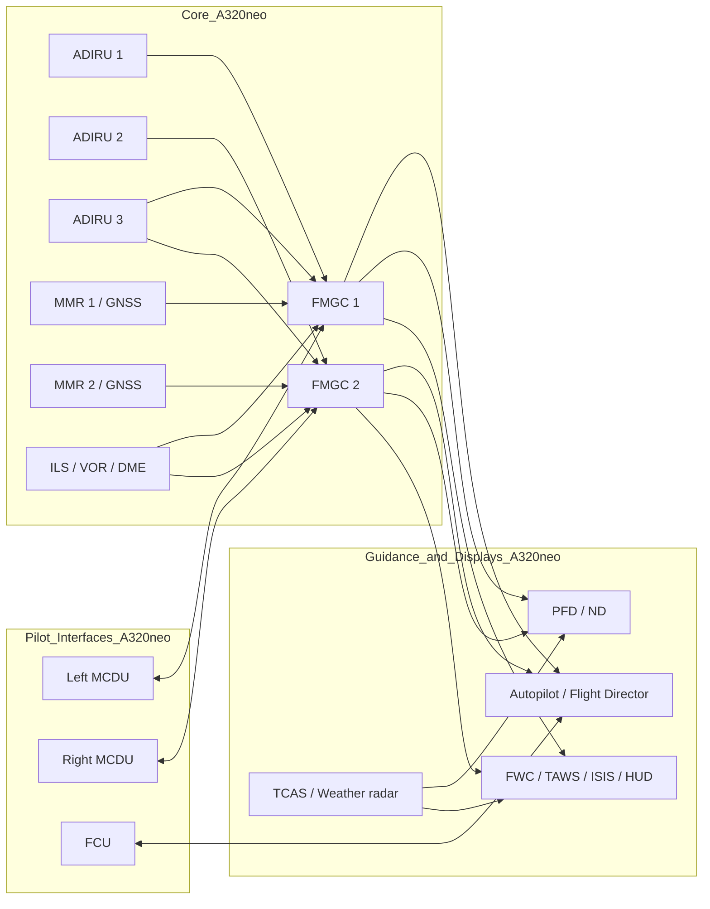

# Navigation Modules Used by Pilots on Boeing 737NG/MAX and Airbus A320neo

## Executive summary

For the purposes of this report, the baseline comparison is the entity["vehicle","Boeing 737 Next Generation","narrow-body airliner family"] / entity["vehicle","Boeing 737 MAX","narrow-body airliner family"] on one side and the entity["vehicle","Airbus A320neo","narrow-body airliner"] within the wider entity["vehicle","Airbus A320 family","single-aisle aircraft family"] on the other. In public, regulator-facing and supplier-facing documentation, the 737 family presents as a more visibly federated navigation architecture: dual FMCS/FMC-class computers, dual CDU-class pilot interfaces, separate EFIS/MCP/NAV tuning panels, dual IRS, and a distinct set of radio, terrain, weather and traffic boxes feeding the display and autoflight chain. The A320neo presents as a more centralised FMGS concept: dual FMGCs, dual MCDUs, an FCU for managed/selected guidance, EIS2 PFD/ND displays, and a triple-ADIRU / dual-MMR sensor backbone feeding guidance, warnings and display functions. citeturn12view0turn12view2turn15view0turn30view0turn26view0turn33view0turn5view2

Both families, however, converge on the same operational logic. Each blends inertial and radio/satellite navigation, uses a coded navigation database updated on the AIRAC cycle, couples the FMS/FMGS tightly to autopilot/flight director guidance, and overlays terrain, traffic, runway and weather cues onto the primary pilot displays. The main difference is architectural emphasis: Boeing’s public material shows more function separated into distinct pilot panels and LRUs, while Airbus’ public material shows more of the navigation/guidance logic concentrated inside the FMGS/FMGC concept, with the FCU acting as the primary mode-selection gateway for the crew. citeturn38view0turn34view1turn34view3turn34view2turn35view2turn26view0turn28view0turn5view1turn5view2

Capability evolution also differs. On 737NG/MAX, current public Boeing material focuses on BFMS modernisation, touchscreen CDUs, Ethernet-linked BFMC/TCDU architecture, navigation-display improvements, and approach/PBN functions such as approach intercept and final-approach RNP selection; the entity["organization","Federal Aviation Administration","US aviation regulator"] 737 training material also includes LPV, GLS and RNP tasks when the aircraft/operator configuration requires them. On A320neo, Airbus’ current public enhancement material is more explicit on FMGC standards and on named approach functions: FLS, FINAL APP coexistence, SBAS Landing System (SLS) and RNP AR-related AP/FD behaviour, with the Honeywell H4 standard explicitly documented for neo coverage and Collins/Honeywell MMR options tied to SLS enablement. citeturn17view1turn8view2turn20view0turn5view0turn5view1turn19search2turn20view5

A final caveat matters. Exact supplier fit is not fully standardised in the public source set for every tail number or airline. On 737NG/MAX especially, Boeing’s own 2026 simulator catalogue still supports both a Boeing BFMC path and a GE-derived legacy soft-FMS path, which implies mixed fleet baselines; on A320neo, Airbus and Honeywell confirm a selectable-supplier philosophy for the FMGS family, but the most explicit current neo-facing public evidence in the reviewed set is for Honeywell H4 rather than a complete neo-wide supplier matrix. Where the public record does not support a single universal supplier or protocol, this report states the documented options and flags the remaining detail as an assumption rather than inventing false precision. citeturn17view0turn27view4turn26view0turn20view0turn19search2

## Scope and source discipline

This report prioritises public primary material from the entity["organization","Federal Aviation Administration","US aviation regulator"], Airbus, Boeing and first-tier avionics suppliers, supplemented where useful by standards-facing material from the entity["organization","International Civil Aviation Organization","UN aviation standards body"] and supplier database documentation. The result is strong on architecture, dispatch/reversion logic, published enhancement standards, interfaces and data-update mechanics, but naturally weaker than a proprietary FCOM/FCTM set on full airline SOP detail. That is why some 737 mode nomenclature points, especially universal fleet-wide LNAV/VNAV declarations, are treated as family assumptions unless directly evidenced in the public documents cited below. citeturn7view0turn10view0turn14view0turn17view0turn33view0turn26view0turn18search2turn18search4

Representative official or OEM-hosted visuals used for this report are collected here because they materially help in understanding cockpit appearance and module form factors:

| Visual reference                                                   | What it usefully shows                                                        |
| ------------------------------------------------------------------ | ----------------------------------------------------------------------------- |
| url737 MAX flight-deck pageturn29search0                       | Official Boeing wide cockpit view and the move to four 15-inch MAX displays   |
| url737 NG flight-deck imageturn31search2                       | Official Boeing visual of the NG LCD flight deck and VSD-era presentation     |
| urlG7501-02 NAV control panel datasheetturn37search1           | Close-up of the 737NG/MAX pedestal-mounted keypad NAV tuning panel            |
| urlAirbus cockpits pageturn32search0                           | Official Airbus A320 cockpit visual and commonality framing                   |
| urlHoneywell Airbus Pegasus FMS technical summaryturn25search7 | A320-series FMGS/FMS architecture and MCDU-focused interface description      |
| urlAirbus SLS article and PDFturn19search1                     | OEM explanation of SLS, SBAS prerequisites and ILS-like approach presentation |

The table above corresponds directly to the cited visual sources and screenshots reviewed for this report, including the Gables NAV panel appearance and Airbus SLS configuration pages. citeturn40view2turn40view4turn33view0turn30view0

## urlBoeingturn17view0 737NG/MAX family

The pilot-facing navigation stack on the 737 family is unmistakably Boeing in layout. The NG public-source picture is a Common Display System with six display units and conventional Boeing panel separation; the MAX public-source picture is a modernised but still recognisably related flight deck with four 15-inch displays. Boeing’s own MAX product page describes the four large displays and the general “integrated navigation features” concept, while its simulator catalogue identifies the MAX Display System as a Collins-developed rehosted display product. Boeing’s official imagery for the NG also highlights liquid-crystal flat-panel displays and the Vertical Situation Display, which is an important vertical-navigation awareness aid even though it is not itself the source of guidance. citeturn30view0turn27view0turn27view1turn31search2turn31search14

At the navigation-compute core, FAA material still shows the 737 as a dual-channel philosophy rather than a single central node. The 737 NG MMEL lists two IRS, dual FMCS computer logic and dual CDU/MCDU arrangements, plus reversionary paths via the IRS data display on the aft overhead and alternate-navigation display arrangements. The 737 MAX MMEL names the Flight Management Computer System / Boeing Flight Management Computer System, explicitly calls out navigation databases and dual CDU/MCDU/TCDU interfaces, and distinguishes aircraft with and without an ISDU. In short, the publicly documented baseline remains “two compute chains with reversionary alternatives”, not “one monolithic nav computer”. citeturn12view0turn12view1turn12view2turn15view0turn15view1turn16view2

Supplier evidence is strongest at the radio-navigation edge. The Gables keypad NAV control panel G7501-02 is type-certified on both 737NG and 737 MAX, is physically a compact pedestal-mounted panel with two frequency windows, numeric keypad and mode keys, and is documented as controlling VOR, ILS, DME, MLS, GLS and LPV/extended-GLS tuning over ARINC 429. The same Gables document states that it works with either a Collins GLU-2100 or a Honeywell IMMR 10.1 receiver, which is the clearest public cross-reference between the 737 pilot control surface and the available MMR hardware options. Collins’ current DME-2100 data sheet then shows the kind of downstream radio architecture the 737 family uses in practice, exposing ARINC 429 and ARINC 709-class interfaces rather than a single integrated network bus. citeturn38view0turn40view2turn34view1

The radio and sensor suite available to the crew is correspondingly blended. Collins describes the GLU-2100 as a digital MMR supporting GLS CAT II/III, SBAS/LPV database-driven PBN approaches, integrated VOR and ADS-B Out-related capability. Collins’ TTR-2100 traffic computer supplies TCAS II logic, its WXR-2100A MultiScan ThreatTrack radar supplies automatic weather-threat detection and prioritisation, and Honeywell’s Mark VII EGPWS combines multiple aircraft parameters and optional internal GPS to deliver terrain, windshear, runway and altitude-callout functions. Taken together, that means the 737 pilot is not using “the FMS alone”, but a federated navigation picture built from inertial, GNSS, radio, traffic, terrain and weather sources that are integrated at display and autoflight level. citeturn34view0turn34view3turn34view2turn35view2

For databases and guidance modes, the modern public Boeing story is BFMS-led. Boeing’s 2023 BFMS navigation-data presentation says the upgrade replaces FMC components with a Boeing Flight Management Computer and Gables TCDU, adds Ethernet wire provisions between TCDU and BFMC, and advertises 46 new/improved features including navigation-source enhancements, approach intercept and final-approach RNP selection. The same Boeing source says BFMS navigation data can be supplied through Jeppesen or through the Boeing-described Lido/NAVBLUE pathway, while Jeppesen states that NavData is available in raw ARINC 424 form or packed proprietary aircraft-loadable form. AIRAC timing remains governed by ICAO’s 28-day cycle. The FAA’s 737 FSB material does not proclaim a universal fleet-wide LPV/GLS/RNP baseline, but it does explicitly include LPV, GLS and RNP approach tasks when applicable, so the correct analytical conclusion is that advanced PBN/LPV/GLS capability on 737NG/MAX is equipage- and approval-dependent, not a simple family yes/no. citeturn17view1turn18search4turn18search2turn8view2

Autopilot/flight-director integration is operationally tight enough that navigation degradations immediately limit automation. On NG, if one FMC alert light is inoperative, the FMC may not be used for autopilot guidance during approach; if both are unavailable, FMC autopilot guidance is barred more generally. On MAX, dispatch with one FMC/BFMC inoperative is possible only under limits, and on some ISDU-equipped aircraft autothrottle must be deactivated. On NG, one IRS may be inoperative only with day-VMC restrictions, the remaining IRS feeding both attitude chains and both HSIs, standby instruments confirmed, and autopilot use heavily constrained unless a specific service bulletin has been embodied. The underlying pilot logic is therefore straightforward: revert to the surviving navigation source chain, stop using degraded coupled guidance, and preserve only the modes that the MMEL and operator procedures still permit. citeturn12view0turn12view2turn15view0turn16view2

### Boeing 737NG/MAX module summary

| Module                       | Publicly documented manufacturer or option                                                                                                                     | Hardware form factor and typical cockpit location                                    | Main software / pilot function                                                  | Interfaces, inputs and outputs                                                                 | Redundancy and fallback                                                                           |
| ---------------------------- | -------------------------------------------------------------------------------------------------------------------------------------------------------------- | ------------------------------------------------------------------------------------ | ------------------------------------------------------------------------------- | ---------------------------------------------------------------------------------------------- | ------------------------------------------------------------------------------------------------- |
| FMS compute core             | Boeing BFMC/BFMS is the current Boeing upgrade path; Boeing simulator support still includes a legacy GE-derived soft-FMS path, implying mixed fleet baselines | LRU-class computer in avionics/equipment bay; not directly pilot-facing              | Route management, database processing, predictions, guidance generation         | Inputs from IRS, MMR/GPS, DME and other avionics; outputs to displays and AFDS                 | Dual-channel FMC/BFMC architecture; dispatch relief exists but with automation restrictions       |
| CDU / MCDU / TCDU            | Boeing-documented interfaces; TCDU upgrade uses a Gables touchscreen unit on BFMS                                                                              | Pedestal-mounted pilot entry/display unit                                            | Flight-plan entry, performance entry, message review, FMS control               | Legacy CDU/MCDU interfaces; BFMS adds Ethernet-linked TCDU/BFMC path                           | Two crew stations; degraded dispatch possible if procedures do not require both                   |
| Display system               | NG CDS; MAX MDS rehost publicly attributed to Collins                                                                                                          | Main instrument panel displays, plus EFIS and MCP controls on glareshield            | PFD/ND presentation, map overlays, VSD and mode/status display                  | Receives FMS/nav/surveillance/terrain/weather data; EFIS panel selects overlays                | NG uses six DUs; MAX replaces with four large displays                                            |
| NAV tuning panel and MMR     | Gables G7501-02 panel; compatible with Collins GLU-2100 or Honeywell IMMR 10.1                                                                                 | Small pedestal keypad panel                                                          | Manual/assisted tuning for VOR, ILS, DME, MLS, GLS and LPV                      | ARINC 429 tuning; ARINC 709/710/711/720/727/755 class compliance                               | Dual radio/navigation chains; GPS-capable MMR combinations can satisfy alternate-nav requirements |
| Inertial / standby nav chain | Boeing-integrated dual IRS with ISDU/IRS display and alternate-nav options; standby path via ISFD/related displays                                             | IRS LRUs in avionics bay; IRS display on aft overhead; standby display in main panel | Inertial position, heading, attitude and backup nav cross-check                 | IRS data to FMCS, displays and autopilot/FD chains                                             | Two IRS installed on NG MMEL; one-inop dispatch is highly restricted                              |
| Terrain / traffic / weather  | Honeywell EGPWS; Collins TTR-2100 TCAS; Collins WXR-2100A weather radar                                                                                        | Separate LRUs feeding main displays and aural alerting                               | Terrain/runway/windshear awareness, conflict alerting, weather threat depiction | Aircraft-state inputs plus optional internal GPS for EGPWS; TCAS and radar feed display system | Largely federated; failures normally downgrade awareness layers rather than basic navigation      |

This table is a synthesis of Boeing, FAA and supplier documents rather than a single OEM wiring manual, and it reflects the most defensible public-source view of the 737NG/MAX pilot-facing navigation stack. citeturn17view0turn17view1turn12view0turn12view2turn15view0turn27view0turn27view1turn38view0turn34view0turn34view1turn34view2turn34view3turn35view2

## urlAirbusturn33view0 A320neo family

The A320neo’s pilot-facing navigation architecture is best understood as an FMGS-centred system rather than as a loose set of separate navigation boxes. Airbus’ official cockpit page emphasises family cockpit commonality, while Honeywell’s Airbus Pegasus summary states that the A320-series FMS consists of two flight-management computers and two MCDUs, with the FM function hosted inside the FMGCs. That same summary makes the key architectural point: the A320-series FMS is selectable supplier-furnished equipment, with Airbus-standard solutions available from urlHoneywell Aerospacehttps://aerospace.honeywell.com and urlThaleshttps://www.thalesgroup.com, but with Airbus defining the core functionality. In other words, the crew sees one Airbus FMGS philosophy even when subassembly suppliers differ. citeturn33view0turn26view0

The FMGS architecture is explicitly redundant. Honeywell states that the two A320-series FM computers run two identical instances of FM software using a dual-modular-redundancy approach, and that the LCD MCDU is essentially a terminal that can talk not only to the FMS but also to other avionics using the ARINC 739 protocol. The same summary lists the avionics categories the FMS must interface with: inertial/attitude reference systems, navigation radios, air-data systems, primary-flight/navigation displays, the flight-control system, engine/fuel systems, datalink and surveillance. That is why the Airbus crew experience feels “integrated”: flight planning, guidance and automation all converge inside one FMGS logic chain rather than remaining visibly separate in the way 737 panels do. citeturn26view0turn28view0

The current neo-facing public evidence is especially clear on the Honeywell path. Airbus’ 2026 A320 enhancement digest says Honeywell FMS2 standard H4 on FMGC 3G is available covering neo, and links it directly to take-off surveillance improvements, FLS/FINAL APP coexistence and SLS CAT I capability. The same Airbus digest shows that SLS on the A320 family requires FMGC 3G H4PC20 or H4PI17, EIS2 standard S17, and an MMR from either Collins (GLU2100) or Honeywell (IMMR L2). Airbus’ separate SLS article explains the functional split behind that equipage: the MMR hosts the SLS function, the FMS hosts the discrete SLS procedures in its navigation database, and the flight warning computer and autopilot are part of the enabling chain. At the time of that Airbus article, Honeywell was the certified SBAS option and the Thales path was still being rolled out on later derivatives. citeturn20view0turn20view4turn5view0turn5view1turn19search2

The inertial and radio-sensor side of the A320neo is correspondingly rich. Airbus’ digest identifies ADIRU 1-3 explicitly, which confirms the triple-ADIRU philosophy, and ties alignment improvement to Honeywell or Litton ADIRU part numbers plus either a GPSSU or an MMR. The operational reason matters: Airbus says an incorrect ADIRU initialisation can generate wrong navigation-display and heading indications during take-off, and the enhancement therefore adds automatic position initialisation, GPS cross-check and shorter alignment time. In parallel, the approach-side FMGS enhancements show how radio and FMS logic are combined: FLS creates an FMS-derived “virtual beam” with temperature correction, SLS provides LPV under SBAS coverage with ILS-like display cues, and FINAL APP is automatically selected for RNP AR or when geometry is unsuitable for FLS. The result is a strongly harmonised Airbus approach philosophy in which non-precision, SBAS and RNP modes are intentionally made to look and feel closer to ILS. citeturn5view2turn5view1turn20view5turn19search2turn40view4

On databases, A320-series public material is more explicit than Boeing’s public material about loading mechanics. Honeywell’s Airbus Pegasus summary says navigation database and related software/components are supplier-unique, that Honeywell moved the A320-series navigation database from smaller legacy capacities to 20 MB and then 64 MB options, and that it supports A615A / A615-3 dataloading and crossloading workflows. The same document also links growing database demand directly to PBN proliferation, including RNAV SIDs/STARs and RNP approaches. Across both Airbus supplier and global industry practice, the database still sits inside the ICAO AIRAC framework, while Jeppesen documents the ARINC 424 basis on the supplier side. citeturn28view2turn28view3turn18search4turn18search2

Autopilot/flight-director integration on Airbus is inseparable from FMGS mode logic. Airbus’ digest shows go-around NAV-mode auto-engagement/arming as part of the RNP AR package, and also documents AP/FD logic enhancements that disengage the autopilot in alternate law near speed boundaries, disengage AP and FD at stall warning in alternate/direct law, and prevent automatic FD re-engagement after an automatic disconnect. That is consistent with the Airbus philosophy of keeping managed guidance available where safely possible, but withdrawing it decisively where degraded-law logic could otherwise mislead the crew. From the pilot’s perspective, the FCU is the immediate mode-selector, the MCDU is the data-entry and FM review point, and the PFD/ND show the result of FMGS guidance synthesis; the underlying FMGC cross-check and reversion logic is mostly concealed from view until a failure or mode downgrade occurs. citeturn5view3turn5view1turn26view0

### Airbus A320neo module summary

| Module                           | Publicly documented manufacturer or option                                                                                                                                         | Hardware form factor and typical cockpit location                            | Main software / pilot function                                                          | Interfaces, inputs and outputs                                                                       | Redundancy and fallback                                                                  |
| -------------------------------- | ---------------------------------------------------------------------------------------------------------------------------------------------------------------------------------- | ---------------------------------------------------------------------------- | --------------------------------------------------------------------------------------- | ---------------------------------------------------------------------------------------------------- | ---------------------------------------------------------------------------------------- |
| FMGS / FMGC core                 | Airbus-integrated FMGC architecture with selectable urlHoneywell Aerospacehttps://aerospace.honeywell.com or urlThaleshttps://www.thalesgroup.com FM software/card options | FMGC LRUs in avionics bay; pilot sees FMGS via MCDUs, FCU and displays       | Flight planning, trajectory prediction, performance, guidance and managed modes         | Interfaces to inertial, radio, air data, displays, flight control, datalink and surveillance systems | Two FM computers running identical FM instances in dual-modular redundancy               |
| MCDU                             | Supplier-specific MCDU hardware with Airbus-standard behaviour                                                                                                                     | Dual pedestal-mounted text/keypad terminals                                  | Flight-plan entry, PERF/APPR pages, FMS control and message handling                    | ARINC 739 terminal interface; can act as terminal to multiple avionics systems                       | Two crew stations; one remaining MCDU preserves significant functionality                |
| FCU and display chain            | Airbus-integrated FCU plus EIS2/PFD/ND environment                                                                                                                                 | FCU on glareshield; PFD/ND on main panel                                     | Managed/selected mode selection, lateral/vertical mode awareness, approach presentation | Outputs from FMGC to PFD/ND and AP/FD; SLS/FLS provide ILS-like cues                                 | Dual FMGC feed path with mode reversion where required                                   |
| ADIRU backbone                   | Honeywell or Litton ADIRU options publicly documented in Airbus digest                                                                                                             | Triple ADIRU LRUs; not pilot-facing except through displays and status pages | Position, attitude, heading and air-data reference to FMGS/displays                     | ADIRU data plus GPS/MMR cross-check used for alignment improvements                                  | Three ADIRUs provide the densest inertial redundancy in this comparison                  |
| MMR / GNSS / radio-approach path | Collins GLU2100 or Honeywell IMMR L2 publicly cited for SLS                                                                                                                        | Separate radio-navigation LRUs feeding FMGS                                  | GNSS/SBAS reception, ILS-like SBAS landing, radio-nav integration                       | MMR hosts SLS; FMGC hosts procedures and guidance logic                                              | Dual-radio philosophy with FMGS-driven mode selection                                    |
| TAWS / warning / support chain   | Airbus digest names FWS, TAWS, ISIS, HUD and FDIMU as part of the SLS/FLS minimum equipment context                                                                                | Mixed LRUs and display/aural outputs                                         | Terrain/runway awareness, warning, backup display support                               | FMGC, MMR and warning computers exchange status for approach functions                               | Multiple support computers; approach functions degrade if prerequisite set is incomplete |

As with the Boeing table, this is a public-source synthesis. The important point is that the A320neo’s navigation stack is visible to the crew mainly as one FMGS ecosystem, even though it is built from multiple LRUs and, in some aircraft, different selectable supplier internals. citeturn26view0turn28view0turn20view0turn5view0turn5view1turn5view2turn5view3turn19search2

## Interconnections and data flows

The diagrams below are deliberately simplified public-source abstractions. They capture the architecture that can be defended from the cited OEM/regulator/supplier documentation, not a full ATA 34 wiring diagram. The key analytical point is that both aircraft families close the same loop — pilot input, sensor fusion, database-driven guidance, display presentation and autopilot/flight-director actuation — but the 737 shows more explicit panel separation, whereas the A320neo hides more of the integration inside the FMGS. citeturn12view0turn15view0turn26view0turn5view1turn38view0

A common data-update abstraction also holds across both families: aeronautical data providers prepare ARINC 424-class content, operators load it through an approved aircraft-specific packaging/dataload path, and the FMS/FMGS then exposes the new procedures to the crew through CDU/MCDU review and to the autoflight/display chain through route and approach selection. Boeing’s public BFMS path now emphasises Ethernet-enabled loading and web-based NDB tools; Honeywell’s Airbus path explicitly documents A615A / A615-3 loading and crossloading. citeturn17view1turn28view3turn18search4turn18search2

## Comparative assessment

The cleanest comparative conclusion is philosophical rather than merely technical. The 737NG/MAX family is a federated-navigation aeroplane that has steadily modernised its pilot interfaces and PBN capability without changing its essential crew experience: separate control panels, an FMS at the centre of guidance, and explicit reversion via remaining FMC/IRS/display paths. The A320neo is an FMGS aeroplane: the crew interacts with a more integrated guidance philosophy in which the FMGCs, MCDUs, FCU and display system present a coordinated “managed” navigation world, with software enhancements such as FLS and SLS explicitly designed to harmonise otherwise different approach types. citeturn30view0turn31search14turn26view0turn5view1turn19search2

| Module class         | 737NG/MAX                                                                          | A320neo                                                                                    | Typical pilot touchpoint                           | Analytical consequence                                                                               |
| -------------------- | ---------------------------------------------------------------------------------- | ------------------------------------------------------------------------------------------ | -------------------------------------------------- | ---------------------------------------------------------------------------------------------------- |
| Compute core         | Dual FMC/BFMC family, with legacy and modernised baselines                         | Dual FMGCs inside FMGS, selectable supplier internals                                      | CDU/MCDU/TCDU versus MCDU + FCU                    | Boeing exposes more federated lineage; Airbus exposes more integrated mode logic                     |
| Inertial backbone    | Dual IRS in public MMEL baseline                                                   | Triple ADIRU in Airbus digest                                                              | Mostly indirect through displays/status pages      | Airbus offers deeper inertial redundancy; Boeing’s reversion is more visibly constrained             |
| Radio-nav/SBAS edge  | MMR/GPS/ILS/VOR/DME controlled via dedicated NAV panel; LPV/GLS equipage-dependent | MMR/GNSS tightly tied to FMGC-driven FLS/SLS logic                                         | NAV panel versus FMGS-selected approach pages      | Boeing keeps more explicit tuning lineage; Airbus makes advanced approaches feel more uniform        |
| Displays             | NG CDS / MAX MDS with VSD and EFIS selection                                       | EIS2 PFD/ND with FMGS-managed presentation                                                 | PFD/ND, EFIS or FCU                                | MAX modernises screen size; Airbus emphasises mode coherence more than panel novelty                 |
| Database/update path | Boeing BFMS: Ethernet-linked modern path and NDB tools                             | Honeywell Airbus path: A615A / A615-3 crossloading and supplier-unique databases           | CDU/MCDU verification and route/approach selection | Similar operational dependency on database integrity, different packaging/tooling ecosystems         |
| Reversion philosophy | Stop using degraded coupled guidance quickly; preserve independent chains          | Preserve managed guidance where safe, but withdraw AP/FD decisively under law/mode hazards | AFDS mode usage versus AP/FD/FMGS reversion        | Boeing’s public documents are more dispatch/restriction centric; Airbus’ are more mode-logic centric |

This comparative table synthesises the preceding Boeing, Airbus, FAA and supplier material rather than quoting a single system manual. The distinctions are architectural and operationally meaningful even where exact box part numbers vary by operator. citeturn12view0turn12view2turn15view0turn30view0turn26view0turn5view1turn5view2turn5view3turn17view1

A second comparison is useful at the level of guidance modes and pilot intent. On Airbus, the public mode vocabulary is explicit: NAV, FINAL APP, FLS, SLS and RNP AR coexistence rules are all documented, and Airbus clearly states when one mode becomes the default or is automatically selected. On Boeing, the public materials reviewed are more feature-list oriented: integrated approach navigation, VSD, approach intercept, final-approach RNP selection, plus FAA training exposure to LPV/GLS/RNP when installed. This matters because it means the public Airbus material is better for understanding exact mode transitions, while the public Boeing material is better for understanding capability envelopes and dispatch consequences. citeturn5view1turn20view5turn17view1turn8view2turn31search14

## Failure handling and pilot reversion

On the 737 family, the public failure logic is strongly dispatch- and reversion-oriented. An IRS failure can still leave the aircraft dispatchable only under major restrictions, including day VMC and standby-instrument confirmation; FMC alert-light or FMC/BFMC degradations directly remove or limit coupled autopilot guidance; and beyond the range of conventional radio navaids, the FAA insists on truly independent navigation capability, not merely “some navigation still available”. The effect on pilot technique is that crews are expected to downgrade from coupled FMS guidance to rawer surviving chains, or to prohibit certain operations entirely, rather than to assume graceful hidden reconfiguration. citeturn12view2turn12view0turn11view2turn16view2

On the A320neo, the public failure logic is more centred on preventing misleading managed guidance and on protecting crew understanding of degraded states. Airbus specifically addresses ADIRU mis-initialisation because it can corrupt ND and heading awareness at take-off; it adds GPS-backed alignment checks to prevent that failure from propagating into line operations. It also publishes AP/FD logic changes that force autopilot or flight-director disengagement in conditions where retaining guidance cues would be unsafe or misleading, and it makes explicit that FLS and FINAL APP coexistence depends on geometry and RNP AR applicability. In practical pilot terms, Airbus is trying to keep the managed picture coherent; when it cannot do so safely, it removes the mode rather than letting the crew continue with an ambiguous automation state. citeturn5view2turn5view3turn5view1

Database integrity is a cross-family criticality. The 737 MAX MMEL explicitly says an out-of-currency or out-of-date navigation database is not authorised MMEL relief for use in a primary navigation system, and ICAO AIRAC logic means the whole industry is synchronised to 28-day effective dates. Jeppesen then provides the formal supplier-side bridge by packaging the data in ARINC 424-compatible form, while Boeing and Honeywell describe their aircraft-specific handling, review and loading toolchains. The practical pilot consequence is simple: no matter how sophisticated the guidance mode, it is only as valid as the current coded procedure and the equipage status the crew actually has available. citeturn15view0turn18search2turn18search4turn17view1turn28view3

The most consequential difference, viewed analytically, is not that one family has “better navigation” than the other. It is that the 737’s public-source navigation story is built around federated modules and explicit reversion constraints, whereas the A320neo’s is built around FMGS-integrated behaviour and harmonised display/mode philosophy. For pilots, that means the Boeing family tends to make the edges between modules and fallback paths easier to see, while the Airbus family tends to make normal-mode navigation cognitively cleaner — but then demands disciplined understanding of FMGS mode logic when things degrade. citeturn12view0turn12view2turn26view0turn5view1turn5view3
