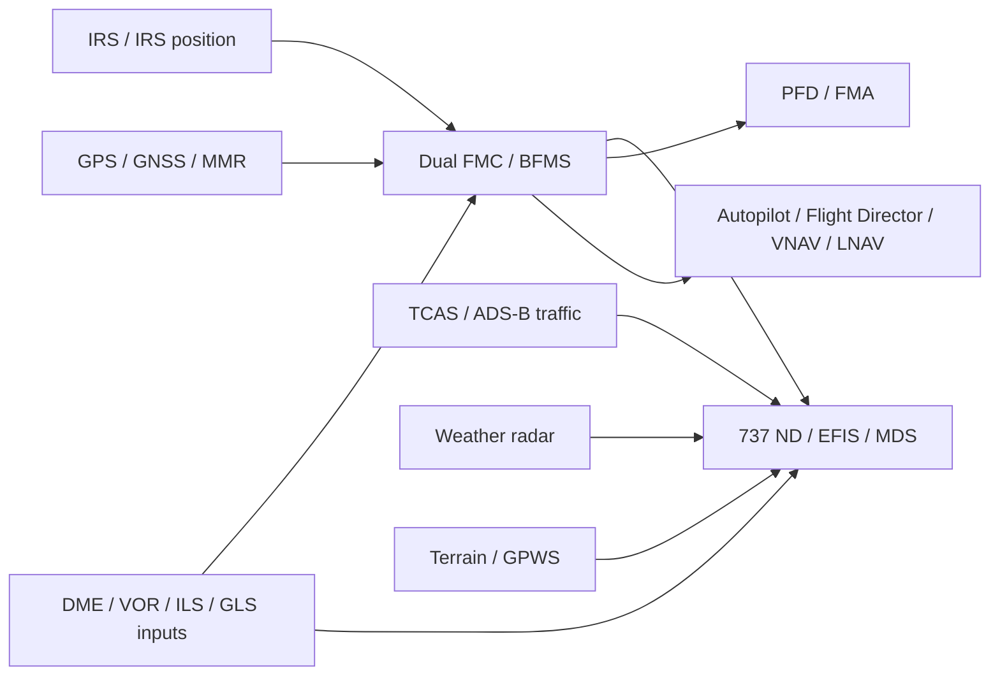
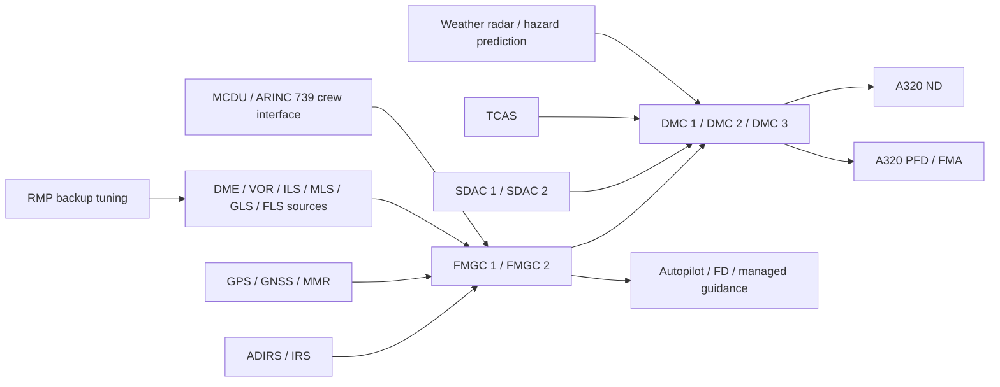

# Navigational Display Modes and Integration on / and

## Executive summary

The two families solve the same pilot task in notably different ways. On the 737NG/MAX side, the ND is a comparatively mode-rich EFIS instrument with distinct **MAP, MAP CTR, VOR, VOR CTR, APP, APP CTR and PLAN** presentations, a strong separation between “expanded” and “centre” views, explicit map-switch declutter, optional/variant-dependent **Vertical Situation Display (VSD)** behaviour, and configuration-dependent extras such as an **Airport Map Function** on the MAX. On the A320neo side, the public Airbus architecture remains more tightly structured around **ROSE ILS / ROSE VOR / ROSE NAV, ARC and PLAN**, with the ND acting as the FMGS map display in NAV/ARC/PLAN, while much of the “approach intelligence” is normalised through Airbus’s xLS concept rather than through a proliferation of named ND modes. citeturn43view3turn30view3turn7view0turn8view0turn32view0

A second major difference is **how guidance philosophy shows up on the ND**. Boeing’s public material emphasises route depiction, raw-data approach display, VNAV path deviation on MAP/MAP CTR, route review through CDU-driven PLAN stepping, and RNP monitoring alongside conventional data. Airbus’s public material emphasises FMGS-managed map presentation, explicit ND support for constraints and temporary-flight-plan review, and xLS/FLS/SLS functions that deliberately make non-ILS approaches look and behave like ILS from the pilot’s perspective. In other words, the 737 ND tends to expose more display “states”, while the A320neo ND tends to expose fewer named states but deeper FMGS coupling. citeturn16view0turn27view2turn43view3turn40view3turn44view1turn32view0turn9view3turn11search10

For **selection logic**, the 737 family uses the EFIS control panel as the primary ND control surface, with mode selection, range selection, centre toggle, traffic selection and map-switch overlays. The MAX public source set also confirms map-switches including **STA, WPT, ARPT, DATA and POS**, and a distinct **Airport Map Function** in the MMEL. Airbus uses the **EFIS control panel on the FCU/glareshield** for ND mode and range selection, with additional ND data-layer controls such as **LS/ILS**, **CSTR**, **ARPT**, and the **ADF/OFF/VOR** selector for bearing-pointer information. citeturn42view0turn30view3turn8view0turn40view0turn40view1turn40view2turn40view3

For **data flow**, both families are federated and sensor-rich rather than “single black box” systems. The strongest public source set confirms on Airbus that the FMGS/FMS interfaces with navigation sensors, displays, flight controls and datalink, with MCDUs using **ARINC 739**, and that the A320 architecture uses **dual FMGCs**, **three DMCs**, **two SDACs**, and reversion logic. On the Boeing side, public supplier data confirm **ARINC 429-class** and related ARINC interfaces on key radio-nav equipment, and public FAA/Boeing configuration material confirms a MAX Display System coupled to a Smiths/GE rehosted FMS; however, the exact **base-aircraft BFMS/FMC-to-ND transport bus** is not explicitly named in the strongest public 737NG/MAX sources reviewed here, so it should be treated as **unspecified in open documentation** rather than inferred as AFDX or Ethernet end-to-end. citeturn19search0turn36view0turn23search0turn18search3turn18search7

Finally, the chief operational difference in failures is that Boeing’s public material is explicit about **raw-data reversion and conventional navigation backup** when FMC position becomes unreliable, whereas Airbus’s public material is explicit about **display reconfiguration, FMGC redundancy, and RMP backup tuning** when FMGC capability is degraded or lost. Both families therefore preserve usable navigation information, but they do so with different emphases: Boeing by preserving “map plus raw data plus conventional tuning”, Airbus by preserving “FMGC plus DMC reconfiguration plus radio-management backup”. citeturn27view2turn43view0turn36view0turn36view2turn36view3

## Scope and assumptions

This report treats an unspecified 737 variant as the combined **737NG/737 MAX** family, but it distinguishes MAX-specific items where the public evidence clearly does so. For the A320neo, it relies heavily on A320-family documentation because Airbus publicly stresses cockpit and operating-procedure commonality across the A320 family, and the strongest open-source technical descriptions of ND behaviour remain A320-family rather than neo-exclusive. citeturn22view0turn21search7

Two caveats matter. First, several detailed ND symbology extracts for both families come from mirrored FCOM or training-document copies rather than directly from OEM portals; I have used them only where they are plainly OEM-origin content and where official public sources do not expose the same page detail. Secondly, the public source set is **not complete** on every transport-layer protocol, button label and overlay-priority nuance. Where the source set is silent, I state that explicitly rather than filling the gap with unsupported certainty. citeturn12search4turn38search7turn7view0

## Boeing 737NG/MAX ND modes, screens and controls

The strongest public 737 material shows the classic 737 ND family as comprising **APP, VOR, MAP and PLN**, with a **CTR** push function that gives centre/rose-style presentations for APP, VOR and MAP. The same material describes **MAP** as heading-up FMC-generated route and map information, **PLN** as a non-moving true-north-up route depiction, **APP** as localiser/glideslope-based approach information, and **VOR** as VOR navigation information. Weather radar and TCAS are not shown in **PLAN**, and they are also not shown in **centre APP** or **centre VOR**. citeturn43view3turn26view1

The 737 EFIS control logic is also unusually visible in open material. The **range selector** chooses the ND scale in nautical miles; the NG training material shows the familiar **5, 10, 20, 40, 80, 160, 320 and 640 NM** ladder, while the traffic switch is integrated as the inner action of the same control. The map-switch set adds and removes supplemental background data and symbols, and the public material explicitly identifies **STA, WPT, ARPT, DATA and POS** as map-switch layers on NG, with the MAX MMEL confirming the same five switch functions on the MAX. citeturn42view1turn42view0turn30view3

The 737 family’s ND therefore has a clear **display-state plus overlay-state** logic:

| 737ND mode or screen     | Normal purpose                                                                                    | Selection method                           | Important limitations / notes                                                                                                                                                                                                                                                           |
| ------------------------ | ------------------------------------------------------------------------------------------------- | ------------------------------------------ | --------------------------------------------------------------------------------------------------------------------------------------------------------------------------------------------------------------------------------------------------------------------------------------- |
| **MAP**                  | FMC route/map display, waypoints, active route, track/heading, VNAV path deviation                | EFIS mode selector to MAP                  | Heading-up; supports map overlays and route symbology. citeturn43view3turn42view0                                                                                                                                                                                                   |
| **MAP CTR / centre MAP** | MAP with full compass-rose centre presentation; on some configurations cycles with VSD            | EFIS CTR push                              | Public NG material says CTR cycles expanded/centre; on VSD aircraft it can cycle centre-with-VSD, expanded, centre-without-VSD. citeturn43view3turn42view0                                                                                                                          |
| **VOR / VOR CTR**        | Raw VOR navigation format with course, DME, TO/FROM                                               | EFIS mode selector to VOR, optional CTR    | Weather radar and TCAS are not displayed in centre VOR. citeturn43view3turn26view1                                                                                                                                                                                                  |
| **APP / APP CTR**        | ILS/GLS approach format with localiser/glide information, frequency/channel, course, DME/distance | EFIS mode selector to APP, optional CTR    | Weather radar and TCAS are not displayed in centre APP. APP can also show GLS channel/course/distance when equipped. citeturn43view3                                                                                                                                                 |
| **PLAN / PLN**           | North-up, non-moving route review                                                                 | EFIS mode selector to PLN                  | Uses CDU LEGS stepping for route review; weather radar and TCAS are not displayed. citeturn43view3turn16view0                                                                                                                                                                       |
| **VSD**                  | Vertical route/terrain-style profile support during approach/descent                              | Configuration-dependent EFIS/CTR logic     | Public sources conflict on MAX control details: FAA difference material says a dedicated VSD switch was removed on the MAX, but one 2021 operator FCOM still refers to a MAX8 VSD switch. Treat MAX VSD selection as configuration/software dependent. citeturn12search2turn16view3 |
| **Airport Map Function** | Airport surface moving-map capability on MAX                                                      | Confirmed as separate MMEL function on MAX | Public source set confirms existence, but not whether every implementation is an ND inset rather than a separate map page. citeturn30view0                                                                                                                                           |

The 737 overlays are also well exposed in public material. The NG systems summary says **WXR** energises the weather radar and displays returns in **MAP, centre MAP, expanded VOR and expanded APP**, and when the 640 NM range is selected those returns are still limited to **320 NM**. The same source identifies **TFC** for TCAS traffic presentation and shows that TCAS indications can appear in **MAP, MAP CTR, APP and VOR** formats. MAX operational material likewise shows the crew explicitly selecting **TERR** or radar on the map during approach setup, and 737 GPWS and TCAS tests drive ND annunciations such as **TERR FAIL / TERR TEST / TERRAIN** and **TCAS TEST PASSED / FAILED**. citeturn43view2turn27view3turn16view2turn15view3turn15view4

A distinctive Boeing feature is how much of the FMS’s route and path logic is shown directly on the ND. Public NG material shows **active and inactive waypoints**, **off-route waypoints**, **holding patterns**, **reference-fix data**, **altitude profile points and identifiers**, and pseudo-waypoints such as **T/C, T/D, S/C, E/D and DECEL**; it also shows a **VNAV path pointer and deviation scale** on MAP/MAP CTR and notes that **ANP/RNP values** can be shown, becoming amber when ANP exceeds RNP. Boeing’s own 737NG marketing page also notes certification to **RNP 0.10 NM**, which explains why the 737 ND/FMS combination is deeply integrated into curved and narrow-tolerance terminal procedures. citeturn26view0turn42view3turn31search13

Operationally, the 737 route-review workflow is unusually clear in the public sources. In **PLAN** mode, the crew can select the **RTE LEGS** page, set range as required, and use **MAP CTR STEP** so that each push moves the centre label to the next geographically fixed waypoint. The public FCOM mirror also shows approach SOPs that recommend the PM’s display remain in **Expanded MAP**, with raw-data support through EFIS **VOR/ADF** selections, reviewed missed approach, checked GPS availability, and confirmed approach RNP values on the FMS progress pages. citeturn16view0turn27view2turn17view3

The 737’s declutter and failure philosophy is equally explicit. When too much information is sent to the ND, the display presents **EXCESS DATA** and the crew removes it by reducing map information, reducing range, or deselecting one or more EFIS map switches. For source loss or invalid information, indications are removed or replaced with dashes. If FMC position becomes unreliable, Boeing’s public FCOM material instructs crews to navigate using the most accurate information available, monitor FMC position using **VOR/ADF raw data** on the non-flying pilot’s ND, and revert to conventional VOR/ADF procedures or radar vectors rather than continuing blindly in LNAV. citeturn43view0turn43view4turn27view2

## Airbus A320neo ND modes, screens and controls

Public Airbus material presents the A320-family ND as having **three core modes**: **ROSE**, **ARC** and **PLAN**. The ROSE mode itself carries the subcases **ROSE-ILS**, **ROSE-VOR** and **ROSE-NAV**. Airbus states that ROSE is **heading-up with the aircraft symbol in the screen centre**, ARC is **heading-up with a 90-degree forward sector**, and PLAN is **north-up and centred on the selected waypoint**. Airbus also states that in **ROSE-NAV, ARC and PLAN**, map data from the FMS are presented. That is the key point for an A320neo reader: the ND is less a collection of separate map “apps” than the display arm of the FMGS. citeturn7view0turn8view0

The Airbus control logic is correspondingly centralised. Airbus’s public training briefing says the **EFIS control panels** are used for selecting ND modes and ranges, and the mirrored Airbus FCOM shows that the selected ND range is **10 to 320 NM**. Public A320 FCOM content also shows additional ND-related EFIS controls and pushbuttons: the **ADF/OFF/VOR** selector drives navaid bearing-pointer display; the **ILS/LS** pushbutton shows the ILS/LS course symbol when an **ILS/GLS/FLS/MLS** approach is selected; the **CSTR** pushbutton displays constraint values below the waypoint ident; and the **ARPT** pushbutton adds optional airport information not already part of the displayed flight plan. citeturn8view0turn40view0turn40view1turn40view2turn40view3

The principal A320neo ND screens and screen states relevant to current operations therefore look like this:

| A320neo ND mode or screen                | Normal purpose                                             | Selection method                                               | Important limitations / notes                                                                                                              |
| ---------------------------------------- | ---------------------------------------------------------- | -------------------------------------------------------------- | ------------------------------------------------------------------------------------------------------------------------------------------ |
| **ROSE-ILS**                             | Raw ILS-style display with localiser/glide information     | EFIS mode selection to ROSE-ILS / LS pushbutton as appropriate | Heading-up, radar available. Public Airbus briefing labels localiser and glide-deviation elements explicitly. citeturn8view0turn8view2 |
| **ROSE-VOR**                             | Raw VOR-style display                                      | EFIS mode selection to ROSE-VOR                                | Heading-up; displays lateral deviation bar, DME and VOR identification. citeturn8view2                                                  |
| **ROSE-NAV**                             | FMGS map display in centred rose format                    | EFIS mode selection to ROSE-NAV                                | Heading-up; FMS map data shown. citeturn7view0turn8view2                                                                               |
| **ARC**                                  | Forward-sector FMGS map display                            | EFIS mode selection to ARC                                     | Heading-up, 90° sector, radar available, FMS map data shown. citeturn7view0turn8view0                                                  |
| **PLAN**                                 | North-up waypoint-centred route review                     | EFIS mode selection to PLAN                                    | FMS map display centred on selected waypoint; cross-track information shown in Airbus briefing. citeturn7view0turn8view2               |
| **TCAS traffic display**                 | Traffic advisories and resolution-advisory traffic symbols | Option / traffic function                                      | Airbus public briefing shows RA red, TA amber, proximate white, off-scale and no-bearing traffic indications. citeturn8view2            |
| **LS / ILS / GLS / FLS course overlays** | Adds approach-course symbol and ILS-like support for xLS   | LS/ILS pushbutton                                              | Public FCOM mirror confirms LS course symbol for ILS/GLS/FLS/MLS selections. citeturn40view0turn40view1                                |
| **Constraint / airport overlays**        | Displays CSTR and ARPT optional map information            | CSTR and ARPT pushbuttons                                      | Airbus public FCOM mirror explicitly confirms both. citeturn40view2turn40view3                                                         |

Where the A320neo becomes especially interesting is in how **FMGS functions map into ND presentation**. Airbus public FCOM text says the ND can display the **temporary flight plan** as a **dotted yellow line**, the active plan as a **continuous green line**, and a new active plan during capture as a continuous green line with interception path logic. The same source shows navaid/waypoint colouring semantics, and the route-review logic explicitly says the temporary flight plan can be checked on the **MCDU and on the ND before inserting changes into the active flight plan**. That is a much tighter route-review loop between FMGS and ND than many short summaries capture. citeturn44view1turn40view1

Airbus also exposes more of its vertical-constraint logic on the ND than its simple mode list might suggest. Public A320 FCOM text says that when the crew presses **CSTR**, the ND displays constraints below waypoint idents in a priority order, and Airbus normal-procedures text relies on monitoring **level-off symbols**, **intercept symbols**, and descent/profile cues on the ND while managing altitude and speed constraints. This means the A320neo ND is not merely a lateral map in NAV/ARC/PLAN; it is a key monitor for FMGS intent and path feasibility. citeturn40view3turn39view0

The biggest neo-era evolution is Airbus’s **xLS/FLS/SLS** philosophy. Airbus’s official xLS material says FLS, SLS and GLS present an **ILS look-alike human-machine interface**, reusing **LOC/G/S laws and logic** with angular deviations, similar SOPs and similar flying technique. The official 2026 A320 enhancement digest further says that on A320-family aircraft fitted with the relevant standards, **FLS** can coexist with **FINAL APP**, is the default mode for qualifying straight-in NPAs, and enhances crew awareness with features including a **virtual LOC beam displayed on the ND**. Airbus’s SLS article adds that the **MMR** computes accurate guidance and streams it to the displays and autopilot, enabling LPV-like straight-in approaches without conventional ILS ground infrastructure. citeturn32view0turn11search10turn11search4turn9view3

This is the single most important interpretive point for A320neo ND analysis: **FINAL APP, FLS and SLS are not “ND modes” in the same way MAP or PLAN are on the 737**. They are **FMGS/MMR-guidance regimes whose route/course/cue consequences are displayed within the existing ND/PFD architecture**, especially through LS-course symbology, route geometry, and xLS look-alike procedures. That architectural choice is why Airbus public material spends more time on guidance-law commonality than on adding brand-new ND pages. citeturn32view0turn9view3turn11search10

The public Airbus material also exposes ND annunciation priorities more directly than Boeing’s open set. The mirrored Airbus FCOM says the ND can display **MODE CHANGE** and **RANGE CHANGE** messages when there is a discrepancy between selected mode/range and what the onside FMGC sends, and that **MODE CHANGE has priority over RANGE CHANGE**. This is a rare openly visible rule about Airbus ND annunciation priority. Airbus’s GNSS-interference safety article adds another practical implication: on aircraft equipped with the Weather Hazard Prediction function, interference can lead to **undue hazard prediction icons** and **undue WEATHER AHEAD messages** on the ND. citeturn40view0turn40view1turn34search0turn35search6

## Data flow, sensors and guidance coupling

The public source set supports the following high-confidence view: on the 737 family, the ND is fed by a federated combination of **FMC/BFMS route data**, radio-navigation receivers, surveillance systems, terrain/warning systems and weather radar; on the A320neo, the ND is generated by **Display Management Computers (DMCs)** and driven by the **FMGC/FMGS**, radio-nav sources, SDAC-delivered system data, and approach/surveillance systems. The exact named transport from “core FMS computer to display computer” is much better documented for Airbus than for Boeing. Airbus supplier material explicitly names **ARINC 739** at the MCDU interface, while Collins supplier material explicitly names **ARINC 429** and related ARINC characteristics on major radio-nav equipment. The source set, however, does **not** provide a similarly explicit open-document statement that “the 737NG/MAX FMS-to-ND backbone is ARINC 429” or “the A320neo ND path is AFDX”; those points should therefore remain open unless backed by aircraft-specific maintenance or supplier interface documents. citeturn19search0turn23search0turn18search3turn18search7

The 737 MAX public configuration material identifies a **Rockwell Collins MAX Display System** and a **GE Smiths rehosted FMS**, while Boeing’s own public MAX page says the flight deck uses **four 15-inch displays**. Public supplier data further show that Collins equipment relevant to ND population includes the **DME-2100** with ARINC **429/600/604/709** characteristics, the **GLU-2100 MMR** for GNSS/LPV-class landing functions, the **TTR-2100/TPR-901** TCAS/ADS-B chain for traffic display applications, and the **WXR-2100A** radar for automatic threat display. From those documents one can confidently say that 737 ND content is sourced from a classic multi-sensor federated avionics set, even if the exact display-input bus naming is not public in the reviewed Boeing documents. citeturn18search3turn31search0turn23search0turn24search1turn23search1turn23search2turn23search5

On the Airbus side, the architecture is more explicitly documented. The public Honeywell Airbus Pegasus summary says the A320-series FMS consists of **two flight management computers and two MCDUs**, with **dual modular redundancy**, and that the FMS interfaces with navigation sensors, displays, flight control, engines/fuel, datalink and surveillance systems. It also states that the LCD MCDU interfaces using **ARINC 739**. Airbus’s A320 family training briefing in turn states that the **three DMCs generate images for the PFD, ND and ECAM**, with **DMC 3** able to replace DMC 1 or 2, while **two FMGCs** control radio-nav tuning in automatic mode and the **RMP** provides backup tuning if both FMGCs are inoperative. citeturn19search0turn36view0turn36view2turn36view3

A technically important Airbus-specific detail is how the FMGS evaluates and fuses position sources. The mirrored A320 FCOM gives the estimated position uncertainty logic for **IRS/GPS**, **IRS/DME/DME**, **IRS/VOR/DME**, and **IRS only**, and Airbus approach guidance material states that RNAV approaches may still be flown under certain conditions with degraded GPS PRIMARY status, while **FLS** is the recommended managed mode for RNAV approaches when equipped. That matters to the ND because the A320 ND is not displaying a generic “moving map”; it is displaying the product of a continuously assessed navigation solution with explicit FMGS confidence logic behind it. citeturn41view3turn41view1

## Pilot workflows and failure reversion

For **route review**, the 737 and A320 families again diverge in style. On the 737, public SOP and FCOM text show route review as a PLAN-driven, CDU-linked task: select **PLAN**, choose range, and use **MAP CTR STEP** on the **RTE LEGS** pages to walk waypoint by waypoint through the route. On the A320, public FMGS text states that the crew can review a **temporary flight plan on the MCDU and on the ND before inserting it**, with PLAN mode centred on the selected waypoint and NAV/ARC/PLAN all using FMGS map data. The 737 workflow is therefore “step the ND through the route”; the Airbus workflow is more “check the revised FMGS picture before commit”. citeturn16view0turn44view1turn7view0

For **approach briefing and execution**, public 737 material consistently recommends retaining **Expanded MAP** for many non-precision and RNAV workflows, using raw-data support via **VOR/ADF** as necessary, checking the approach RNP on progress pages, and using **VSD**, **TERR** or weather radar selections according to the approach and crew role. Boeing’s public material is explicit that raw-data backup remains part of the technique. Airbus’s public material, by contrast, frames the workflow around the **selected approach guidance regime**: conventional ROSE-ILS/VOR when flying radio approaches, or xLS/FLS/SLS logic when equipped, with **LS**, **CSTR**, and optional airport/course information assisting monitoring. Airbus’s “let’s use xLS” and xLS-product material are explicit that **FLS/SLS are meant to be flown as ILS look-alikes**, reducing procedural branching in the last segment. citeturn27view2turn16view2turn16view4turn32view0turn11search4turn11search10

For **loss of nav integrity or display capability**, Boeing’s strongest public procedures focus on _what to trust next_. If FMC position is unreliable, the crew is told to use the most accurate information available, cross-check on the other pilot’s ND with raw VOR/ADF data, and, if necessary, revert to conventional navaid procedures or radar vectors. ND source loss is shown through flags, dashes and dedicated messages such as **EXCESS DATA**, **TCAS TEST FAIL**, or **TERR FAIL**. Airbus’s strongest public procedures focus on _what architecture remains available_. The public A320 sources state that **DMC 3** can replace failed display computers, that the display arrangement supports **PFD/ND** and **ECAM/ND** transfer, and that if both FMGCs are lost, radio receivers can still be tuned from the **RMP**, with one surviving FMGC otherwise able to control all receivers. Airbus’s GNSS-interference article adds a modern reversion nuance: some interference cases primarily show up as misleading ND/hazard symbols rather than total map loss. citeturn27view2turn43view0turn15view3turn15view4turn36view0turn36view2turn36view3turn35search6

## Comparative summary

| Family        | Major ND modes/screens                                                                                                      | Selection method                                                                           | Confirmed overlays / layers                                                                                                  | Data and guidance coupling                                                                                                                                    | Redundancy / reversion                                                                                                                                                              | Typical cockpit location                                                                                                                                                                            |
| ------------- | --------------------------------------------------------------------------------------------------------------------------- | ------------------------------------------------------------------------------------------ | ---------------------------------------------------------------------------------------------------------------------------- | ------------------------------------------------------------------------------------------------------------------------------------------------------------- | ----------------------------------------------------------------------------------------------------------------------------------------------------------------------------------- | --------------------------------------------------------------------------------------------------------------------------------------------------------------------------------------------------- |
| **737NG/MAX** | MAP, MAP CTR, VOR, VOR CTR, APP, APP CTR, PLAN; configuration-dependent VSD; MAX Airport Map Function                       | EFIS control panel mode selector, range selector, CTR push, TFC inner switch, map switches | WXR, TFC/TCAS, TERR, STA, WPT, ARPT, DATA, POS; raw VOR/ADF support                                                          | FMC/BFMS route, VNAV path deviation, waypoints, pseudo-waypoints, raw VOR/ILS/GLS data, TCAS, WX, terrain                                                     | Dashes/flags for invalid data; EXCESS DATA declutter; revert to VOR/ADF or radar vectors if FMC position unreliable; MAX VSD selection details configuration-dependent              | _Assumption from standard 737 layout:_ onside ND in each pilot’s main display set; MAX uses four 15-inch displays. citeturn43view3turn42view0turn30view3turn43view0turn27view2turn31search0 |
| **A320neo**   | ROSE-ILS, ROSE-VOR, ROSE-NAV, ARC, PLAN; TCAS traffic presentation; xLS/FLS/SLS content within existing ND/PFD architecture | EFIS control panel mode/range; LS/ILS, CSTR, ARPT, ADF/OFF/VOR selectors; MCDU/FMGS inputs | LS course symbol, constraints, optional airports, ADF/VOR bearing-pointer display, TCAS traffic; radar available in ROSE/ARC | FMGS map data in ROSE-NAV/ARC/PLAN; temporary-flight-plan and capture logic; xLS/FLS/SLS/FMGS-managed course presentation; MMR/FMGS/autopilot tightly coupled | DMC 3 replacement for DMC 1/2; PFD/ND and ECAM/ND transfer; one FMGC can control all receivers; both FMGCs lost gives RMP backup tuning; MODE CHANGE has priority over RANGE CHANGE | Airbus publicly confirms a PFD and ND on each pilot’s side-by-side DU pair. citeturn8view0turn40view0turn40view1turn36view0turn36view2turn36view3                                           |

The most operationally meaningful comparison is this: the **737 ND is a pilot-configured tactical instrument with many explicit display states**, whereas the **A320neo ND is an FMGS-managed tactical/strategic display whose most important modern differences show up as guidance functions inside existing modes rather than as many extra mode names**. That is why the Boeing discussion naturally centres on MAP/CTR/VOR/APP/PLAN and declutter, while the Airbus discussion naturally centres on ROSE/ARC/PLAN plus **FLS/SLS/FINAL APP** coexistence and FMGS mode logic. citeturn43view3turn32view0turn11search10

## Representative image and document links

For official and near-official visual references, the following are the most useful starting points from the reviewed source set:

**Boeing / 737 family**

- url737 MAX flight deck overview on Boeing.comturn31search0
- urlFAA 737 MAX MMEL draft showing MAX EFIS map switches and Airport Map Functionturn29search0
- urlFAA simulator configuration sheet identifying the MAX Display System and FMSturn18search3
- urlBoeing 737 NG design highlights page noting RNP capabilityturn31search13
- url737 NG flight-instruments systems summary PDF with ND mode/symbology pagesturn28search4

**Airbus / A320 family / neo-relevant**

- urlAirbus cockpit commonality pageturn22view0
- urlAirbus xLS system-upgrades pageturn32view0
- urlAirbus FAST article on SLS with cockpit symbology and architectureturn11search5
- urlA319/A320/A321 Flight Deck and Systems Briefing for Pilots PDFturn7view0
- urlA320-family FCOM mirror with ND indications, EFIS controls and FMGS presentation pagesturn38search7

**Supplier reference sheets**

- urlHoneywell Aerospace Pegasus FMS for Airbus A320/A330 technical summaryturn19search0
- urlCollins Aerospace GLU-2100 MMR data sheetturn24search1
- urlCollins Aerospace DME-2100 data sheetturn23search0
- urlCollins Aerospace TTR-2100/4100 TCAS data sheetturn23search1
- urlCollins Aerospace WXR-2100A MultiScan ThreatTrack data sheetturn23search2
- urlJeppesenhttps://ww2.jeppesen.com
- urlNAVBLUEhttps://www.navblue.aero
- urlThaleshttps://www.thalesgroup.com

## Open questions and limitations

The reviewed public source set was strong on **modes, controls, architecture, and operational logic**, but weaker on three points. First, the exact **base-aircraft FMS-to-display transport bus** for the 737NG/MAX ND was not explicitly named in the strongest open Boeing sources reviewed, so it remains unspecified here. Secondly, the Airbus public set clearly confirms **ARPT, CSTR, LS and ADF/VOR** ND controls, but does not expose every A320 EFIS pushbutton label in an OEM-hosted page; some finer-grain layer names therefore remain only indirectly evidenced in mirrored FCOM content. Thirdly, the MAX **VSD selection logic** is not fully harmonised across public documents: FAA difference material says the dedicated VSD switch was removed, while at least one airline-customised MAX FCOM still refers to a VSD switch. Those items should be confirmed against an operator’s own FCOM/FCTM or IPC for a line-accurate fleet view. citeturn18search3turn19search0turn12search2turn16view3
